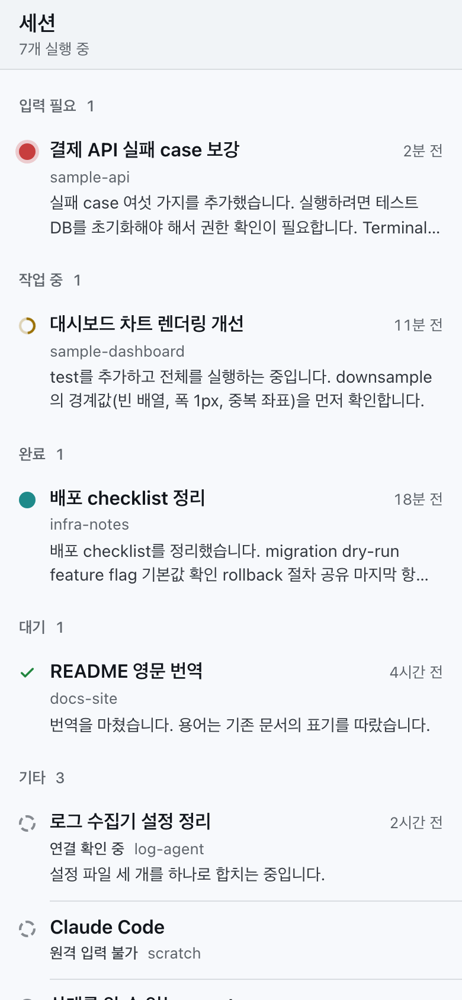
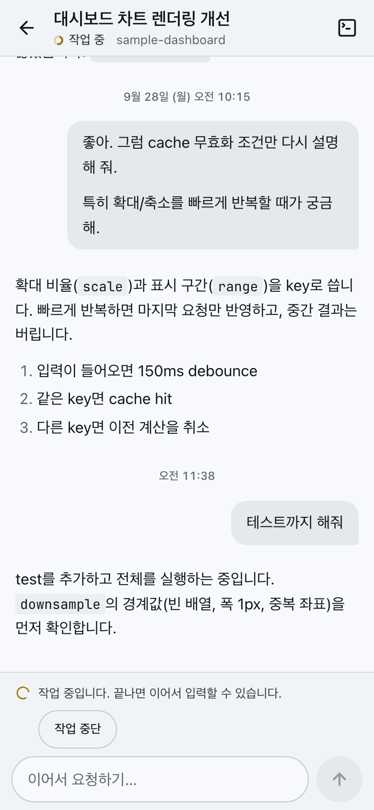
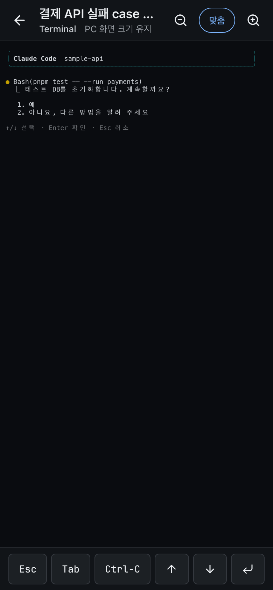

# Herdr Mobile Chat

> **English summary.** Herdr Mobile Chat (`herdr-remote`) is a single-user companion for
> [Herdr](https://github.com/herdrdev/herdr). It lets you read and continue Claude Code sessions
> that are already running in Herdr panes from a phone browser, over localhost or Tailscale Serve.
> The Bridge never starts or resumes agents: Herdr owns the processes and PTYs, and chat history
> is read from Claude Code's native transcripts. It requires macOS, Claude Code, and a Herdr build
> with the conditional input patch ([`psw7205/herdr`](https://github.com/psw7205/herdr/tree/mobile-binding),
> branch `mobile-binding`); stock Herdr `0.9.1` lacks the required API. Codex is not supported yet.
> This is a personal project, not affiliated with Herdr. The documentation is in Korean.

Herdr에서 이미 실행 중인 coding agent를 모바일 브라우저에서 확인하고 같은 session에
입력하는 single-user, single-host client다. Herdr가 process와 PTY를 소유하고,
Chat은 native transcript를 읽어 표시한다. Bridge는 agent를 직접 실행하거나 resume하지 않는다.
repo와 Go module 이름은 `herdr-remote`다.

[Herdr](https://github.com/herdrdev/herdr)는 여러 coding agent를 terminal pane에서 실행하고
관리하는 도구다. 이 repo는 Herdr의 공식 project가 아닌 개인 companion tool이다.

<p align="center">
  
  
  
</p>

화면은 익명 sample을 쓰는 dev 전용 fixture page(`web/fixture.html`)에서 캡처했다.

## 현재 지원 범위

| 항목 | 상태 |
| --- | --- |
| Claude Code / macOS | 기존 session 발견, Chat, prompt, interrupt, Terminal fallback |
| 대화 복구 | incremental JSONL, snapshot/replay/live, Bridge 재시작 뒤 복구 |
| 입력 보호 | Herdr binding 검증, durable command receipt, 같은 command 재전송 방지 |
| 모바일 UI | 상태별 session 목록, Chat, light/dark theme, code 복사, 특수 키가 있는 Terminal, PWA. 실기기 keyboard와 설치형 PWA는 미검증 |
| Tailnet | Serve 경유 소유자 phone에서 Chat·prompt·Terminal 확인. 화면 잠금·네트워크 전환 뒤 reconnect와 다른 사용자 거부의 실측은 미검증 |
| Codex | 미지원. native transcript 구조만 조사했다 |
| 새 session 생성 | 미구현. 설정한 폴더에서 Herdr로 시작하는 방식으로 결정했다(ADR-037) |
| Tool card·Changed Files·attachment·notification | 미구현 |

Claude의 localhost handoff와 Bridge 재시작 복구는 실제 process에서 검증했다.
미검증 scenario와 우선순위는 [Backlog](docs/backlog.md)에 있다.

## 기술 스택

- Frontend: React + TypeScript + Vite, pnpm
- Bridge: Go `net/http`, `coder/websocket`, `fsnotify`, `log/slog`
- Terminal: xterm.js의 visible ANSI snapshot 표시
- Toolchain: `mise.toml`
- Persistence: command receipt만 disk에 보존. conversation DB·Redis·broker 없음

## 사전 조건

| 항목 | 조건 |
| --- | --- |
| OS·agent | macOS에서 Herdr pane으로 실행 중인 Claude Code interactive session |
| Herdr | 조건부 입력 patch가 적용된 Herdr server가 실행 중이어야 한다. 아래 설명 참조 |
| Toolchain | [`mise`](https://mise.jdx.dev). Go·Node.js·pnpm version은 `mise.toml`이 고정한다 |
| Tailscale | 모바일 원격 접속에만 필요하다. Bridge host와 mobile device가 같은 tailnet에 로그인돼 있어야 한다 |

Bridge는 Herdr가 꺼졌을 때 대신 시작하지 않는다. stock Herdr `0.9.1`에는 필수 API인
`agent.binding`과 `agent.bound_input`이 없다. 필요한 patch는 fork
[`psw7205/herdr`의 `mobile-binding` branch](https://github.com/psw7205/herdr/tree/mobile-binding)
(`v0.9.1` 위의 단일 commit `0e672c5e`)다. build·설치·rollback·upgrade 절차는
[Herdr patch runbook](docs/herdr-patch.md)을 따른다. stock과 patched binary가 같은 version
문자열을 사용할 수 있으므로 version이 아니라 `doctor`로 확인한다. Herdr updater가 stock
binary를 설치하면 조건부 입력이 비활성화되며 Bridge는 입력을 fail closed한다.

## 빠른 시작

먼저 localhost에서 동작을 확인한다.

1. patched Herdr를 준비한다. [Herdr patch runbook](docs/herdr-patch.md)의 §3–5(build, stock
   binary 백업·설치, live handoff)를 따른다. 실행 중인 Herdr server를 종료하지 않는다.
2. 저장소 root에서 client를 build하고 `doctor`로 확인한 뒤 Bridge를 실행한다.

   ```sh
   mise install
   mise exec -- pnpm --dir web install --frozen-lockfile
   mise exec -- pnpm --dir web build

   export HERDR_SOCKET_PATH="$(herdr status server | sed -n 's/^socket: *//p')"
   test -S "$HERDR_SOCKET_PATH"
   mise exec -- go run ./cmd/doctor -socket "$HERDR_SOCKET_PATH"
   mise exec -- go run ./cmd/bridge -herdr-socket "$HERDR_SOCKET_PATH"
   ```

3. 같은 machine의 브라우저에서 [http://127.0.0.1:8787](http://127.0.0.1:8787)로 접속한다.

`doctor`는 read-only이며 transcript 원문이나 binding token을 출력하지 않는다. 종료 코드 0은
조회 성공이고, 모든 handoff acceptance의 완료를 의미하지 않는다. `blockers`가 비어 있는지,
`conditional_input`이 `supported`이고 대상 agent의 `verified_binding`이 참인지 확인한다.
Tailnet을 아직 설정하지 않았어도 blocker는 아니다. localhost 전용 사용도 지원 범위다.

Vite hot reload와 변경별 검증 절차는 [CONTRIBUTING.md](CONTRIBUTING.md)에 있다.

## Tailnet 접속

원격 경로는 Tailscale Serve 하나다([ADR-024](docs/adr.md#adr-024--tailnet을-primary-security-boundary로-사용한다)).
Bridge는 항상 loopback에만 bind하고, Serve가 tailnet HTTPS 요청을 Bridge로 proxy한다.

1. Tailscale 관리 화면의 DNS 설정에서 MagicDNS와 **HTTPS Certificates**를 활성화한다.
   tailnet마다 한 번만 필요하다.
2. Bridge host에서 Serve를 켠다. `8787`은 Bridge `-listen` port다.

   ```sh
   tailscale serve --bg 8787
   ```

   tailnet에서 Serve를 처음 쓰면 CLI가 활성화 URL을 안내한다. Funnel은 켜지 않는다.
3. Bridge를 (재)시작한다. `-tailnet-host`와 `-tailnet-login`은 기본값 `auto`이므로 추가 flag가
   필요 없다. Bridge는 시작할 때 한 번 `tailscale status --json`을 읽어 host와 소유자 login을
   정하고, host와 login이 모두 확정된 경우에만 `https://<tailnet-host>`를 Origin allowlist에
   추가한다. 시작 log에 확정된 host·login과 그 출처가 남는다. Tailscale 상태를 바꾼 뒤에는
   Bridge를 재시작해야 반영된다.
4. `doctor`를 다시 실행해 `tailnet.issues`가 비어 있는지 확인한다. `issues`는 문제마다 조치
   방법을 적는다. Bridge `-listen`이 `127.0.0.1:8787`이 아니면 같은 주소를 `-bridge-listen`으로
   넘긴다. 그렇지 않으면 Serve proxy 확인(`serve_proxy`)이 거짓 음성이 된다. CLI 경로는 Bridge와
   같이 `-tailscale-bin`으로 명시할 수 있다. Funnel이 켜져 있거나, identity header 없이 Bridge에
   닿는 Serve TCP forward(`--tcp`/`--tls-terminated-tcp`)가 있으면 top-level blocker다. 둘 다
   `--bg` 없이 실행한 foreground 설정까지 확인한다.
5. 소유자 계정으로 로그인한 mobile device에서 `https://<tailnet-host>`에 접속한다. 화면 잠금·
   네트워크 전환 뒤 WebSocket reconnect는 아직 실기기에서 검증하지 않았다.

Tailscale CLI가 없거나 실패하거나 Tailscale이 실행 중이 아니면 Bridge는 종료하지 않고
localhost 전용으로 동작한다. 단, `-tailnet-host`를 명시했는데 `auto` login만 확정하지 못했다면
host는 유지하되 모든 tailnet 요청을 거부한다. tagged node처럼 소유 사용자 login이 없을 때도
같다. 이때는 `-tailnet-login`으로 소유자를 명시한다. login이 없는 동안 `-origins`에 넣은
tailnet HTTPS Origin은 경고 log와 함께 제외되고 Bridge는 계속 시작한다.

### 보안 경계

Bridge는 Serve가 검증해 추가한 `Tailscale-User-Login`을 소유자 login과 대조한다. 다른
사용자나 누락된 identity는 읽기·제어 모두 거부한다. HTTP mutation과 WS는 exact Origin도
검사한다. Serve는 client의 `Host`를 그대로 넘기므로 Bridge는 `X-Forwarded-*`나
`Tailscale-User-*` header가 있는 요청을 `Host`와 무관하게 tailnet 요청으로 보고, tailnet host와
소유자 login이 확정되지 않았으면 거부한다. 그래서 Serve 외의 local reverse proxy를 앞에 두는
구성은 지원하지 않는다. 모든 응답은 frame 삽입을 금지한다. 자체 password/OAuth/JWT는 없다.
network 경계도 좁히도록 tailnet ACL/grant로 Bridge host의 HTTPS 접근을 필요한 device로 제한한다. [Serve identity 동작](https://tailscale.com/docs/features/tailscale-serve)과
[Tailscale 접근 정책](https://tailscale.com/docs/features/access-control/acls)을 참고한다.

## Bridge 설정

| Flag | 기본값·역할 |
| --- | --- |
| `-herdr-socket` | `$HOME/.config/herdr/herdr.sock`. 다른 named session은 명시적으로 지정 |
| `-claude-dir` | `$HOME/.claude`. Claude native transcript root |
| `-receipts-dir` | `$HOME/.local/state/herdr-remote/receipts`. durable command receipts |
| `-listen` | `127.0.0.1:8787`. loopback만 허용 |
| `-static` | `web/dist`. 시작 시 `index.html` 존재 확인 |
| `-origins` | `http://127.0.0.1:8787`. comma-separated exact Origin 목록. 지정하면 기본값을 대체하므로 localhost 접속이 필요하면 `http://127.0.0.1:8787`도 직접 포함한다. Tailnet Origin은 host와 login이 모두 확정되면 자동 추가된다 |
| `-tailnet-host` | `auto`: `Self.DNSName`에서 끝의 점을 제거한 값. `off`: Tailnet 요청을 받지 않는 localhost 전용. 그 밖의 값은 Serve DNS host로 사용 |
| `-tailnet-login` | `auto`: 이 Tailscale node를 소유한 사용자 login. 명시 값은 Serve로 접근할 수 있는 단일 사용자 login |
| `-tailscale-bin` | Tailscale CLI 경로. 비우면 PATH, 이어서 알려진 설치 경로에서 찾는다 |

전체 flag는 `mise exec -- go run ./cmd/bridge -h`로 확인한다.
`-herdr-socket`은 CLI flag이며, 위 예시의 `HERDR_SOCKET_PATH`는 shell이 전달하는 값이다.

## 데이터와 lifecycle

```text
기존 Herdr agent → native transcript → Go Bridge → Chat
Chat command → durable receipt → Herdr binding 검증 → 기존 PTY
```

- Chat 메시지는 native transcript에서 관찰된 뒤 표시한다. `accepted`는 PTY 전달 결과다.
- `delivery_unknown`은 자동 재전송하지 않는다. 같은 초안은 browser reload 뒤에도 같은 `command_id`를 사용한다.
- transcript가 불명확하면 Chat prompt를 막는다. 검증된 binding이 있으면 같은 Terminal로 전환한다.
- Terminal은 frame을 교체 표시한다. raw output history 전체를 replay하거나 mobile 크기로 PTY를 resize하지 않는다.
- Herdr binding이나 capability를 잃어도 agent가 같은 pane에서 계속 보고되면 검증됐던 `claude:` session은 `ended`가 아닌 `unverified`로 남고 입력과 Terminal은 fail closed한다. 같은 native session의 binding이 다시 검증되면 `active`로 돌아간다.
- native session을 식별하지 못한 `pane:` item은 binding이 없으면 `unbound`다. 같은 pane에서 `claude:` session이 새로 검증되면 `pane:` item은 `superseded`와 `successor_id`를 보고하고, Web UI는 successor의 binding으로 Chat·Terminal을 이어 간다.
- WS 종료나 Bridge 종료는 Herdr process를 중단하지 않는다. Bridge restart는 새 epoch로 native history를 복구한다.
- receipts를 임의로 지우면 오래된 command ID의 재수락을 막는 근거가 사라진다.

## 운영과 알려진 제한

정적 파일 변경은 `pnpm --dir web build`, Go 변경은 binary 재빌드와 **Bridge만의 재시작**이
필요하다. 사용자 `launchd` 등 process manager를 쓸 수 있으며 host별 실행 설정은 Git 밖에서
관리한다. 이 repo에는 자동 service 설치 script가 없다. `launchd`는 PATH가 최소한이고 macOS에서는
Tailscale CLI가 app bundle wrapper로만 있을 수 있으므로, 자동 탐색이 실패하면
`-tailscale-bin`으로 CLI 경로를 지정한다.

Herdr live handoff는 테스트에서 agent PID·native session을 보존했지만 terminal ID를
재발급했고 desktop client가 끊긴 동안 geometry를 기본 120×40으로 변경했다. 이 동작은
mobile Terminal의 resize와 별개다. 검증한 범위와 남은 조건은 [검증 기록](docs/records/verification.md)을 따른다.

### 진단 출력 공유

`doctor` JSON과 Bridge log에는 tailnet host, 소유자 login, socket·transcript 절대 경로가 들어갈 수
있다. issue 등에 붙일 때는 이 값을 `<tailnet-host>`, `<login>`, `<path>` 같은 placeholder로 바꾼다.
prompt와 transcript 본문은 log에 쓰지 않는다.

## 문서

| 문서 | 용도 |
| --- | --- |
| [AGENTS.md](AGENTS.md) | agent 작업 규칙과 제품 불변식 |
| [CONTRIBUTING.md](CONTRIBUTING.md) | 개발 server, 검증, issue·PR 정책 |
| [SECURITY.md](SECURITY.md) | 취약점 비공개 신고와 보안 범위 |
| [PRD](docs/prd.md) | 제품 요구와 범위 |
| [ADR](docs/adr.md) | architecture 결정 |
| [Architecture](docs/architecture.md) | 결정을 조합한 runtime 구조, data flow, invariant |
| [검증 기록](docs/records/verification.md) | 구현 경계와 실제 검증 결과 |
| [Integration 조사](docs/records/integration-findings.md) | Herdr/Claude/Codex 코드·runtime 근거 |
| [Herdr patch runbook](docs/herdr-patch.md) | 조건부 입력 patch의 확인·설치·rollback·upgrade |
| [Backlog](docs/backlog.md) | 남은 작업의 우선순위·의존 관계·완료 기준 |

## License

[Apache License 2.0](LICENSE)
